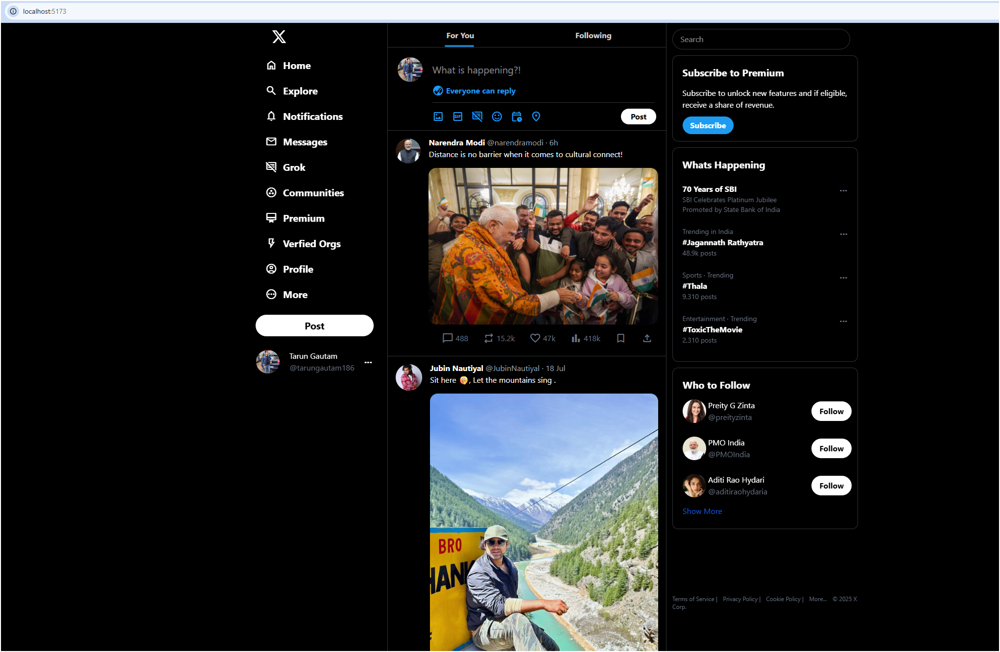
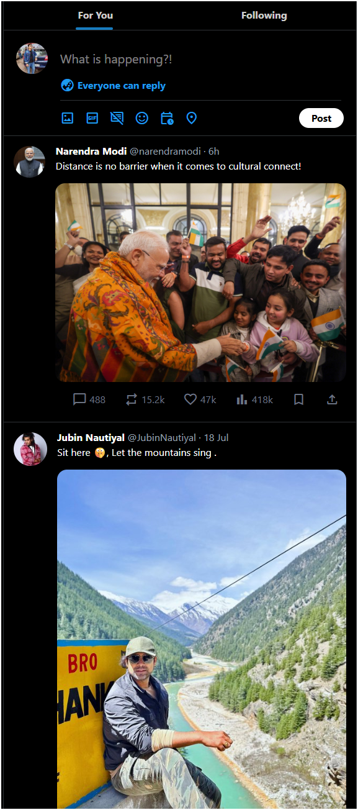
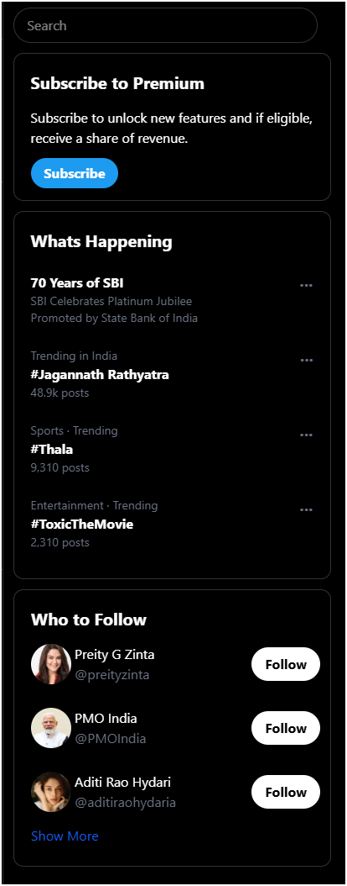
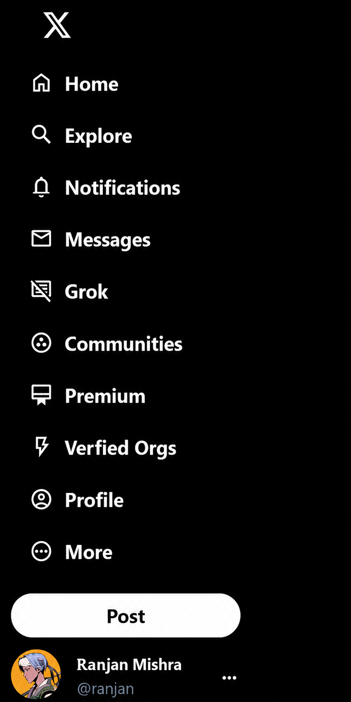
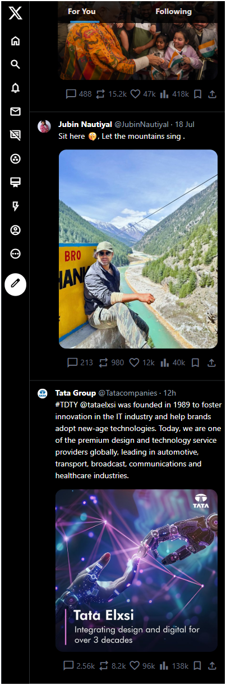
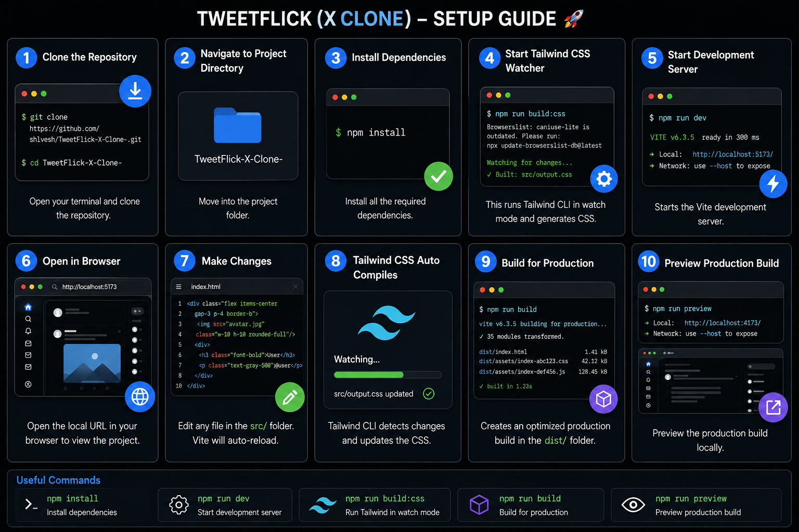

# 𝕏 TweetFlick — X UI Clone

A responsive frontend recreation of **X (formerly Twitter)** built with **HTML, Tailwind CSS, and Vite**.

TweetFlick recreates the familiar X interface with a desktop three-column layout, mobile responsive feed, navigation sidebar, post composer, trending section, discovery panel, and profile UI.

---

## 🖼️ Platform Preview

### Desktop Home



### Feed Experience



### Discovery & Trends



### Sidebar Navigation



### Mobile Responsive View



### Setup Guide



---

## ✨ Features

* Responsive X/Twitter-inspired interface
* Three-column desktop layout
* Mobile responsive experience
* Navigation sidebar
* Tweet/post feed
* Post composer
* Engagement counters
* Search interface
* Trending topics
* Premium subscription card
* Who-to-follow section
* Profile/account UI
* Tailwind CSS utility styling
* Vite development environment

> TweetFlick currently focuses primarily on frontend UI recreation and responsive design.

---

## 🛠️ Tech Stack

| Technology      | Purpose                       |
| --------------- | ----------------------------- |
| HTML5           | Application structure         |
| Tailwind CSS v4 | Styling and responsive design |
| Vite            | Development server            |
| Node.js         | Development environment       |
| npm             | Dependency management         |
| Git             | Version control               |
| GitHub          | Repository hosting            |

---

## 📂 Project Structure

```text
TweetFlick-X-Clone-
│
├── screenshots/
│   ├── tweetflick-home.png
│   ├── tweetflick-feed.png
│   ├── tweetflick-discovery.png
│   ├── tweetflick-sidebar.png
│   ├── tweetflick-mobile.png
│   └── tweetflick-setup-guide.png
│
├── src/
│   ├── index.html
│   ├── input.css
│   └── output.css
│
├── .gitignore
├── favicon.ico
├── package.json
├── package-lock.json
└── README.md
```

---

## 🚀 Getting Started

### 1. Clone the Repository

```bash
git clone https://github.com/sh1vesh/TweetFlick-X-Clone-.git
```

### 2. Enter the Project Directory

```bash
cd TweetFlick-X-Clone-
```

### 3. Install Dependencies

```bash
npm install
```

---

## 🎨 Run Tailwind CSS

Open a terminal inside the project folder and run:

```bash
npm run build
```

This watches:

```text
src/input.css
```

and generates:

```text
src/output.css
```

Keep this terminal running while developing.

---

## ⚡ Start the Vite Development Server

Open another terminal in the same project directory:

```bash
npm run dev
```

Vite will display a local URL, usually:

```text
http://localhost:5173/
```

Open it in your browser.

---

## 📜 Available Commands

### Start Development Server

```bash
npm run dev
```

### Start Tailwind Watcher

```bash
npm run build
```

### Install Dependencies

```bash
npm install
```

---

## 🧭 Navigation

TweetFlick recreates the main X navigation experience with:

* Home
* Explore
* Notifications
* Messages
* Grok
* Communities
* Premium
* Verified Organizations
* Profile
* More
* Post button

---

## 📰 Feed Experience

The main feed contains:

* User avatars
* Display names
* User handles
* Post timestamps
* Text posts
* Image posts
* Replies
* Reposts
* Likes
* Views
* Bookmarks
* Share actions

---

## 🔎 Discovery Panel

The desktop interface includes a dedicated right-side discovery area featuring:

* Search
* Premium subscription section
* What's Happening
* Trending topics
* Promoted content
* Who to Follow suggestions

---

## 📱 Responsive Design

TweetFlick uses Tailwind responsive utilities to adapt the interface across different screen sizes.

On smaller displays:

* Sidebar labels are hidden
* Navigation becomes icon-focused
* Discovery panel disappears
* Feed receives more screen space
* Layout remains usable on mobile screens

---

## 🎯 Project Goals

This project was created to practice and demonstrate:

* Frontend development
* Responsive layouts
* Tailwind CSS
* UI recreation
* Flexbox-based layouts
* Mobile breakpoints
* Vite development workflow
* Git and GitHub usage
* Project documentation

---

## 🔮 Future Improvements

Planned or possible improvements include:

* Functional post creation
* Like interactions
* Reply system
* Repost functionality
* Bookmarking
* Search functionality
* Follow/unfollow interactions
* Profile pages
* User authentication
* Dynamic trending topics
* Backend API integration
* Database integration
* Persistent posts
* Dark/light mode
* Improved accessibility
* Better mobile navigation

---

## 📦 Requirements

Before running TweetFlick, make sure the following are installed:

* Node.js
* npm
* Git

Check with:

```bash
node -v
npm -v
git --version
```

---

## 🔧 Development Workflow

After making changes:

```bash
git add .
git commit -m "Describe your changes"
git push
```

Example:

```bash
git add .
git commit -m "Improve TweetFlick interface"
git push
```

---

## 👨‍💻 Maintainer

**Shivesh**

GitHub: [@sh1vesh](https://github.com/sh1vesh)

---

## ⚠️ Disclaimer

TweetFlick is an independent frontend recreation created for **educational, learning, and demonstration purposes**.

This project is not affiliated with, endorsed by, or officially connected to **X Corp., Twitter, or X**.

All trademarks, logos, names, and brand assets belong to their respective owners.
